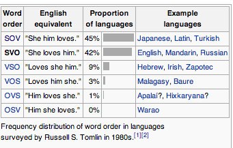

## The Problem
Identifying the subject, verb, and object of a simple sentence.

1. Understand the problem
2. Divide the problem into smaller, easier problems
3. Implement and test at each stage.

### Understand the Problem
What is a Subject? Verb? Object?

From wikipedia:

The verb is the divider. 
What comes before is the subject. 
What comes after is the object.

1. Identify the Verb v
2. Use v to divide the sentence.
3. Classify what comes before v as Subject, and after v as Object

### Divide problem into smaller problems

* Identify verbs
* Divide sentence
