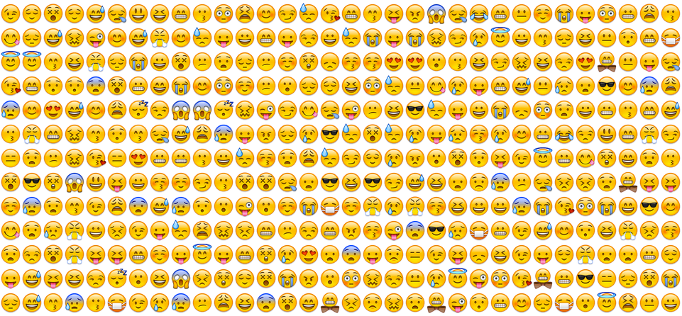

# Week 3

- Add yourself to the [Who's Who](https://docs.google.com/a/artic.edu/spreadsheet/ccc?key=0Al9H_nC6SnFMdHZKekFVTDZsU2IwbHItR3o4b1EtYnc&usp=sharing).
- Check out the proposed [meeting themes](https://docs.google.com/spreadsheet/ccc?key=0Al9H_nC6SnFMdGJCOUZuQ094Q1dja2ZNSFhQZ2N4WkE&usp=sharing).

## Emoji Demo



Lets finally build something, in real-time, together!
Ever wanted a web page wall of 1,000+ emoji that constantly animate? Thought so, lets make it!

Not at the meet-up? No problem, [here](../examples/emoji) is the finished demo.

### Libraries

Libraires make your life 10,000 times easier. They might seem a bit scary at first when you are trying to learn vanilla (regular) JavaScript, but they can actually save you tons of hours writing code. Don't be scared :)

The Emoji project that we are going to build uses three:

- [Emojify.js](http://hassankhan.github.io/emojify.js/) (images only)
- [Underscore.js](http://underscorejs.org)
- [jQuery](http://jquery.com/)

We'll use Emojify.js for the emoji images, Underscore.js for some handy array functions, and jQuery.js to manipulate the DOM (rendering to the browser).

### Getting Started

Let's get coding. I've created an empty project directory that has all of the needed libraries (and emoji data) already setup [here](lets_build_emoji).

### What's Next

Remember how I said that JavaScript is [interpreted instead of compiled](http://www.programmerinterview.com/index.php/general-miscellaneous/whats-the-difference-between-a-compiled-and-an-interpreted-language/)? Copy and paste the following code into the browser's console:

```javascript
$("img").each(function(){
  $(this).css({
    width: "64px", height: "64px"
  });
});
```

You can manipulate the image size (or any global variable or function for that matter) in this fashion. Try playing around hacking the emoji demo live from the console.

Before next week see if you can add some sliders that each control:

- The number of emoji
- The size of the emoji
- The refresh rate of each emoji

Hint: Update the `numEmoji`, `size`, `minTime`, and `maxTime` variables using  [range input's] value attributes. Make sure that you update your code to reflect the changes. Look into jQuery's [change method](http://api.jquery.com/change/).
