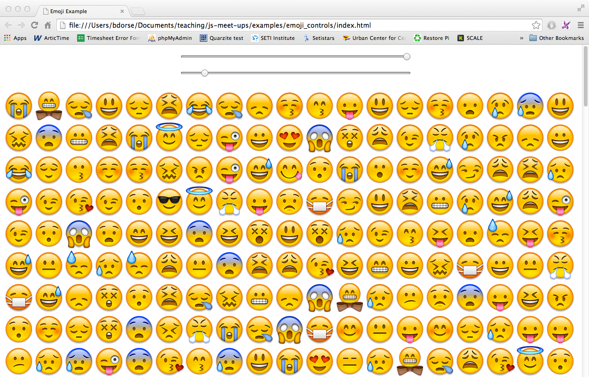
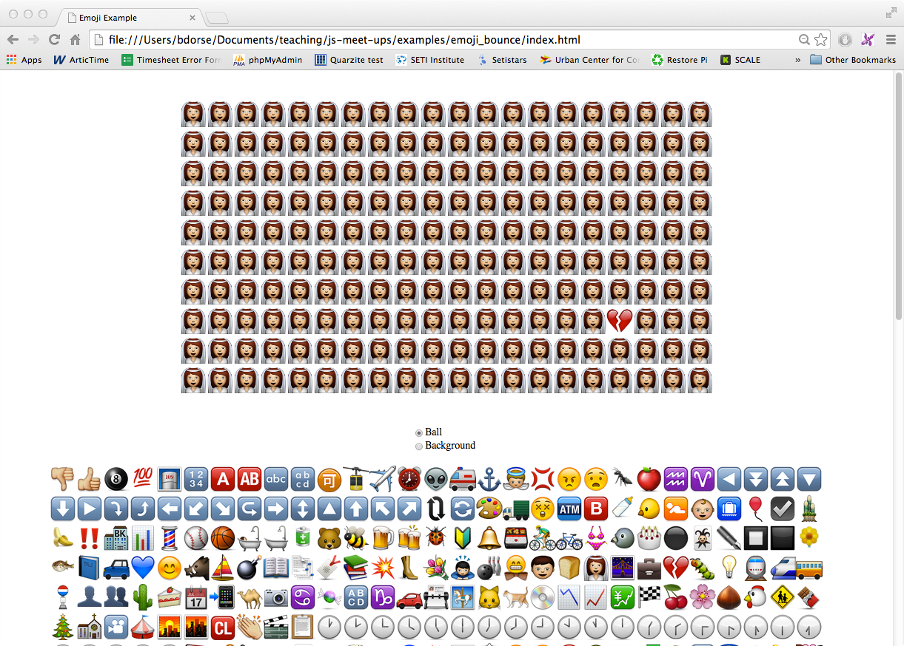

# Week 4

Lets build some more emoji demos! We'll start off by adding some sliders to control the size and refresh rate of the [emoji example](../examples/emoji) that we built last week. Let's write our code in this week's [`lets_build_emoji_controls`](lets_build_emoji_controls) template. You can see the final code [here](../examples/emoji_controls).

We will also build another emoji demo that replicates a ball bouncing on a 2D screen. In this demo, the user will be able to customize the emoji that represent both the ball and the background. Lets code inside the [`lets_build_emoji_bounce`](lets_build_emoji_bounce) folder. You can view the completed demo [here](../examples/emoji_bounce)

