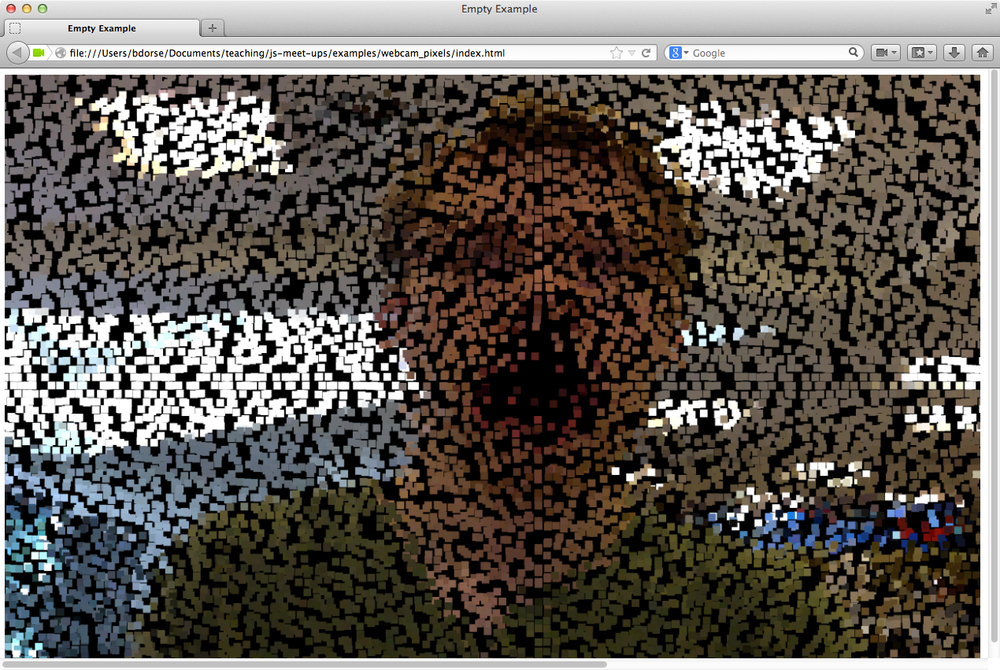

# Week 6

This week we will take a look at webcam video capture and image processing with HTML5. Its been a long time coming, but webcam pure JavaScript + HTML webcam support finally starting to become standard on most browsers. Check out this [link](http://www.html5rocks.com/en/tutorials/getusermedia/intro/) for a bit more info.

For a look at this week's finished demo, check out the [`examples/webcam_pixels`](../examples/webcam_pixels) folder. We can build the demo from scratch inside of [`week_06/lets_build_webcam_pixels`](lets_build_webcam_pixels).

Our goal is to create a sketch that render's the webcam feed into colored rectangles (pixels) that repel from on-screen clicks. We will be using the [Sylvester.js](http://sylvester.jcoglan.com/) library for basic vector math as well as [jQuery](http://jquery.com/) to help with some DOM Manipulation. Both libraries are pre-loaded into the `lets_build_webcam_pixels` directory.

To briefly summarize this week's code, we need to:

1. Load the webcam feed into a HTML `<video>` element.
1. Grab the current video frame from the `<video>` element and draw it to an in-memory canvas.
1. Use the `imageData` (RGBA Values for each pixel) from the in-memory canvas to update the color of our rectangles in the canvas that is rendered to the browser.
1. Update the position of each rectangle according to the locations on the rendered canvas the have been clicked.